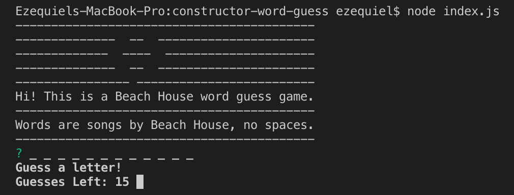

# Constructor Word Guess - Beach House edition 🤖
UT Austin Coding Bootcamp | Unit 11 js constructors \
v1.0 \
Orig. Deployment - October 28, 2018

# Idea
The challenge was to write a word guess game--similar to our earlier word guess game--but now using constructors! Can you say refactoring? :)

# User Guide

Here's how it works:

- Open up Terminal / your CLI
- Make sure to download the appropriate node modules according to the package.json file
- Type `node index.js` and hit Enter
- Follow the prompts
- Have fun!

The game uses basic concepts in node packages, modules, constructors and dotenv, so is good for a first run at playing with constructors via node!

# Built Utilizing: 
dotenv \
inquirer \
node.js

# Original Contributors:
Ezequiel Calderon (current edition and ongoing maintenance) - <https://github.com/playeasynow>

# Get Involved!
If you have any recommendations, let me know! Email: ezequiel.calderon.jr@gmail.com. If you'd like to take it in your own direction, go right ahead. 
